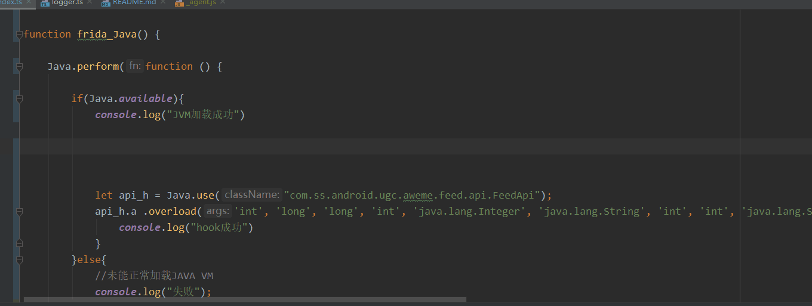

### 使用该工程可以为编写frida提供来自TS的智能提示

方法代码源自 git://github.com/oleavr/frida-agent-example.git

1. clone本仓库到本地

2. 到仓库根目录下使用npm install命令安装依赖

3. 使用有智能提示的idea打开工程 推荐vscode或者ws

4. 开发前输入 `npm run watch` 监控index.ts 文件即时转换成index.js

5. 编写index.ts 代码即可，体验良好

6. 运行脚本 frida -U -f com.ss.android.ugc.aweme --no-pause -l _agent.js  可以边修改边运行，无需重启app

相关截图 

